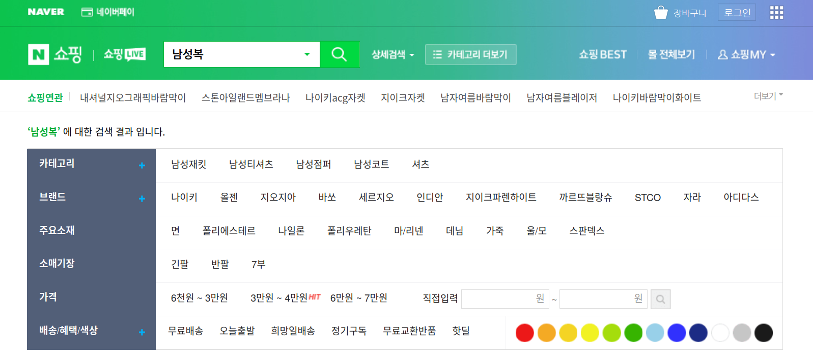

# PJ2_Laptop_Price_Analysis

# 1. Introduction

## 1.1 Business of laptop 

The global laptop market size was values at USD 101.67 billion in 2017. According to Technavio report, 
the global laptop market size is expected to increase by 7.52 billion between 2019 and 2024. Because of its potability and price efficient, 
people are gointg to buy own laptop more and more. 

There are a lot of sites that provide spec and prices of laptops. It is hard to choose balanced laptop for each people
(some people may need laptop for machine learning, other people may need laptop for browsing.), because every parts of laptop
changes its price everyday. So providing proper prices is important thing for consumers. 

## 1.2 About Dataset 

Dataset source url : [Kaggle Competition](https://www.kaggle.com/datasets/muhammetvarl/laptop-price)
    
1. Company- String -Laptop Manufacturer
2. Product -String -Brand and Model
3. TypeName -String -Type (Notebook, Ultrabook, Gaming, etc.)
4. Inches -Numeric- Screen Size
5. ScreenResolution -String- Screen Resolution
6. Cpu- String -Central Processing Unit (CPU)
7. Ram -String- Laptop RAM
8. Memory -String- Hard Disk / SSD Memory
9. GPU -String- Graphics Processing Units (GPU)
10. OpSys -String- Operating System
11. Weight -String- Laptop Weight
12. Price_euros -Numeric- Price (Euro)

# 2. Project1 : Regression Analysis(Laptop Price Prediction) 

Price prediction is forecasting prices based on its characteristics, features, and etc. Data Scientist 
use various algorithms and statistics techniques to make accurate model predicting target values. 

The goal of this project is exploring dataset using pandas, plotly moduel and predicting price of laptop accurately.

The techiniques i get from this project is web scraping which use selenium and bs4(beautifulsoup). Contents 
are recorded in [my blog : web scraping](https://eded-hiscalifh.tistory.com/206) 

The model i used for predicting prices is RandomForestRegressor and XGBoostReressor. The accuracy report 
using those model is such as below : 

|Model|Best Score|r2 score|Mean Squared Error|Mean Absolute Error|Cross Validation Score| 
|:---:|:---:|:---:|:---:|:---:|:---:|
|Random Forest Regressor|0.746079689443224|0.716547|133726.670349|255.923919|0.719578|
|XGBoost Regressor|0.8337336055936219|0.833884|78369.965505|180.22065|0.833711|

The best model is XGBRegressor with 0.833% Accuracy(Model is stored in 'laptop_prediction_model.pkl'), and model parameter is same as below : 

- XGBRegressor(base_score=0.5, booster='gbtree', colsample_bylevel=1,
             colsample_bynode=1, colsample_bytree=1, enable_categorical=False,
             gamma=0, gpu_id=-1, importance_type=None,
             interaction_constraints='', learning_rate=0.300000012,
             max_delta_step=0, max_depth=3, min_child_weight=3, missing=nan,
             monotone_constraints='()', n_estimators=250, n_jobs=12,
             num_parallel_tree=1, predictor='auto', random_state=0, reg_alpha=0,
             reg_lambda=1, scale_pos_weight=1, subsa)
             
In this project, I performs predicting price of laptops from its features. I can get infortmation about 
Web scraping using selenium and bs4 module and make model file using sklearn.externals.joblib method. 

# 3. Project 2 : Time Comparison of Range Search Algorithms 

In computer science, the range searching problem consists of processing a set S of object, in order to determine which objects from S intersect with a query object, called the range. For exmple, if S is a set of points corresponding to the coordinates of several cities, find the subset of cities within a give range of latitude and longitutdes. 

The range searching problem and the data structure that solve it are a fundamental topic of computational geometry. Applications of the problem in areas such as GIS(geographical information systems), CAD(computer-aided design) and databases. 

We can see various usecase of range search from various filed. In [Naver Shopping](https://search.shopping.naver.com/search/all?query=%EB%82%A8%EC%84%B1%EB%B3%B5&cat_id=&frm=NVSHATC) as an example, we can find products in proper budgets.
    

The goal of this project is comparing various ways(Full search, Binary Search, CSV Index) of executing range search from its execution time.

